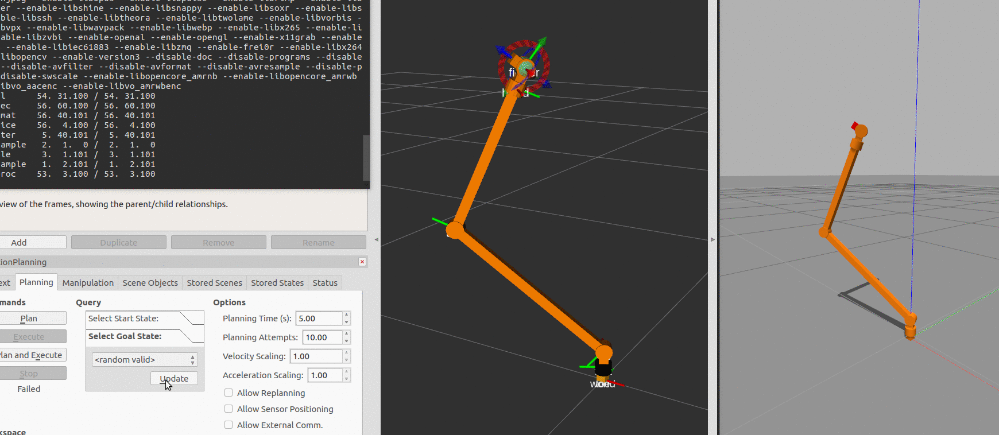
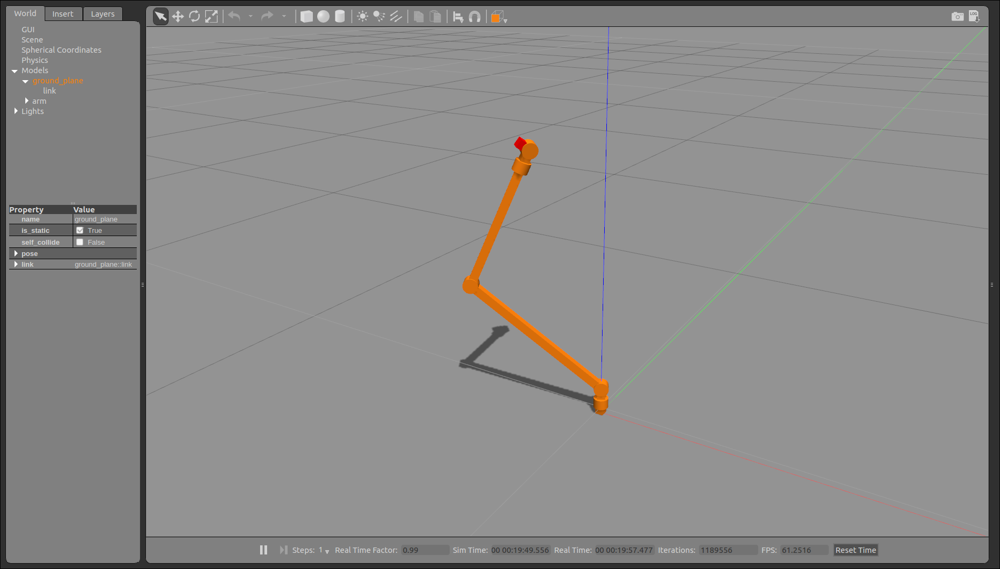
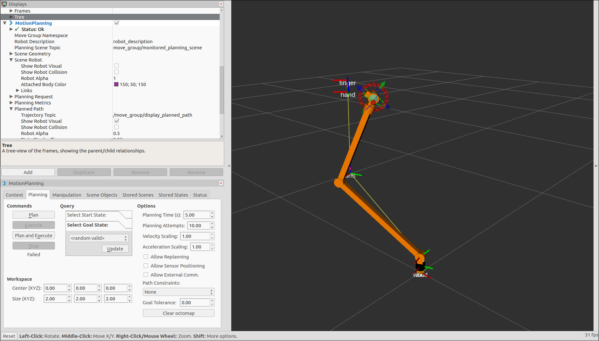

# Arm



This repository contains the simulation of a custom robotic arm. This was done in order to gain experience with some nice features of ROS: robot description using [urdf](http://wiki.ros.org/urdf/XML) and [xacro](http://wiki.ros.org/xacro), simulation in [Gazebo](http://gazebosim.org/), joint-space control based on the inverse dynamic model of the arm with help of the [KDL](http://www.orocos.org/kdl) library, trajectory control with [ROS Control](http://wiki.ros.org/joint_trajectory_controller), and finally inverse kinematics and planning with [MoveIt!](http://moveit.ros.org/). 

___

#### Usage
Install dependencies:
```
rosdep install --from-paths src --ignore-src -r -y
```
Build catkin workspace:
```
catkin_make
```
Init the environment:
```
source devel/setup.sh
```
Launch the gazebo simulation:
```
roslaunch arm_gazebo empty_world.launch
```
Launch the controller along with RViz:
```
roslaunch arm_control rviz.launch
```
Launch the MoveIt! move group:
```
roslaunch arm_control moveit.launch
```
You can now use the MoveIt! plugin in Rviz to control the arm.
___

**[Gazebo](http://gazebosim.org/)**



**[RViz](http://wiki.ros.org/rviz)** with the **[MoveIt! plugin](http://docs.ros.org/kinetic/api/moveit_tutorials/html/doc/ros_visualization/visualization_tutorial.html)**


